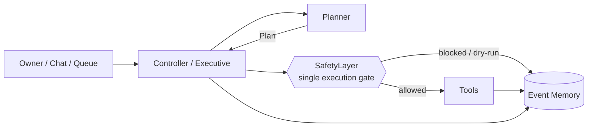
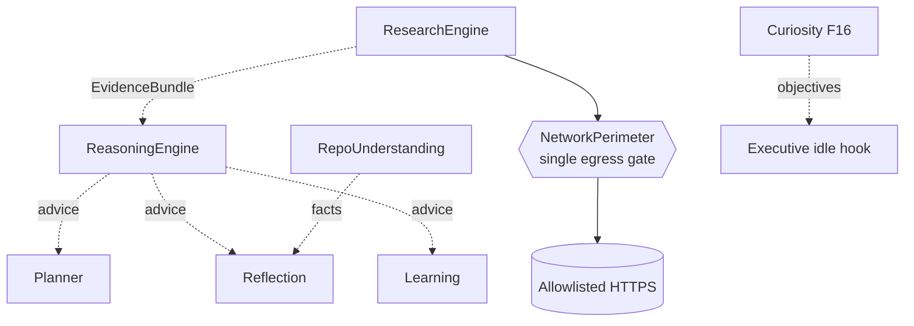
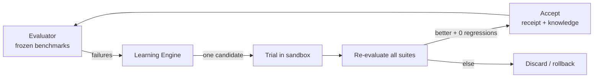
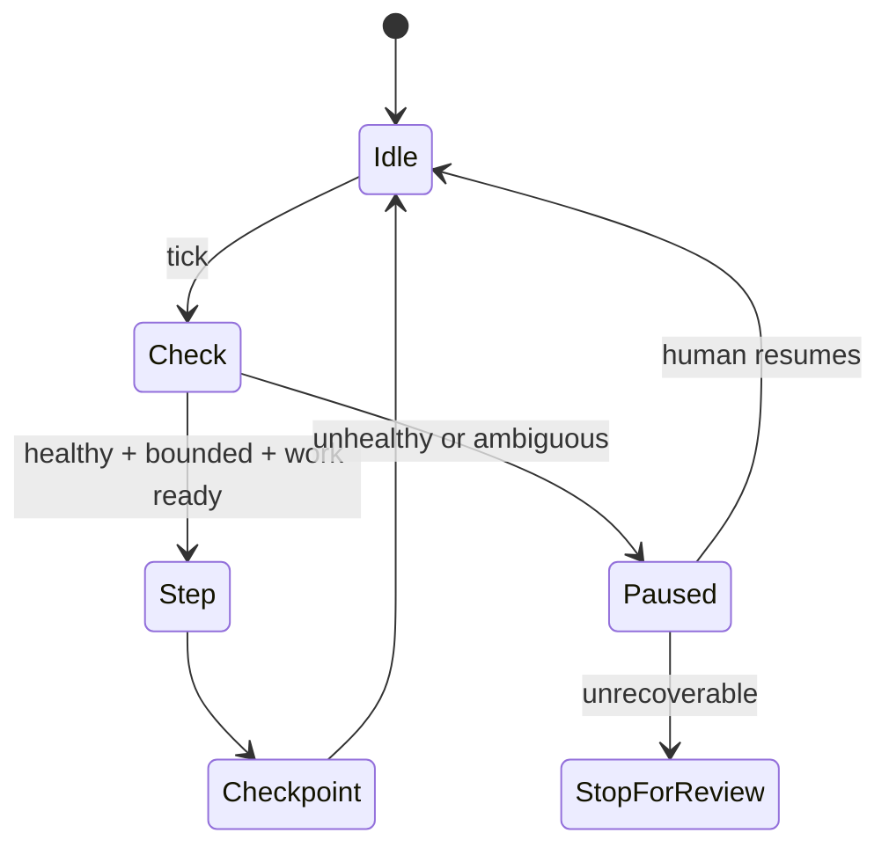

# Architecture overview

Visual summary. The authoritative detail is in `architecture/ARCHITECTURE_BASELINE.md` and the living spec.

## The spine

## Advisors (read-only, no authority)

## The improvement loop

## Unattended / AFK

## Boundaries

| Side effect | Sole owner |
| --- | --- |
| Execute tool | `SafetyLayer.run()` |
| Network (research) | `NetworkPerimeter.fetch()` |
| Network (models) | `network_egress.model_provider` |
| Persistence | owned append-only stores |
| Patch validation | throwaway sandbox |
